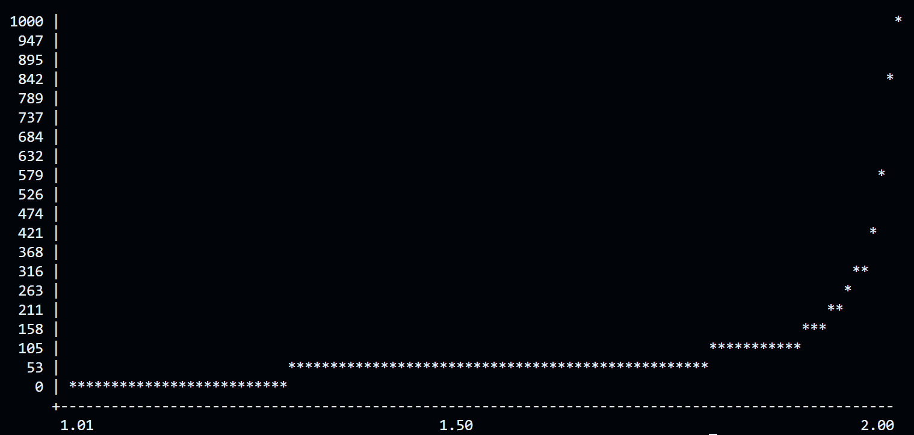

# Fortran JMU Project

This repository contains a portion of a programming project I worked on at James Madison University in their Math 448 Numerical Methods course in 2007.  The programming assignment was to implement various numerical method algorithms in Fortran 90 code.  

I have included a portion of that programming assignment in this repository to show off how you can use GitHub Copilot to modernize legacy code.

The folder [fortranSrc](fortranSrc) has the original unmodified Fortran code I wrote for the project.

The folder [dotnetSrc](dotnetSrc) has GitHub Copilot generated code that converted the Fortran 90 code into C# code.

Below is a sample scatter plot showing the number of iterations required to solve a linear system of equations using a Successive Over Relaxation (SOR) method as the relaxation parameter varies from 1.0 to 2.0.

